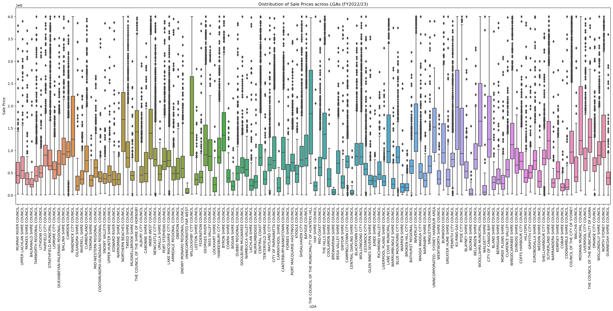

# NSW-Property-Data
Constructing a database of and visualising NSW property price and rental data across suburbs over the past 5 years. 

This data is incredibly difficult to discover without an expensive subscription to a service that licences its data from the Department of Finance and Services, Land and Property Information. To be clear, this data was obtained for personal, non commercial use.

This analysis is geared towards retail investors. It provides a general snapshot of the NSW property market with some interesting insights on inter-LGA differences.

An example of the analysis found in the analysis.ipynb file:
